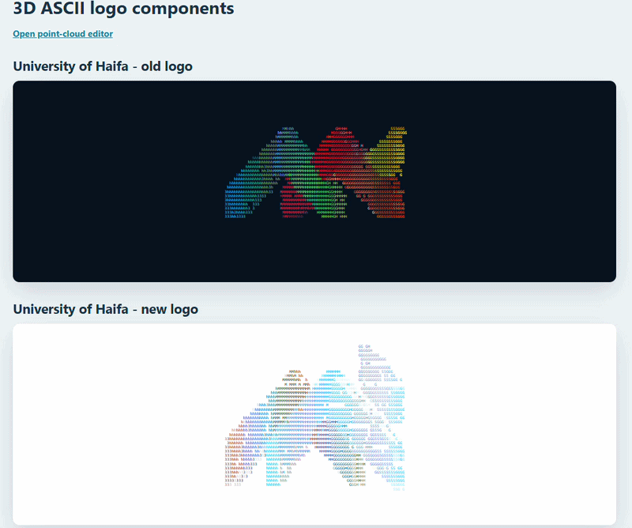

# ASCII Point Cloud Studio

A browser-based renderer and editor for turning colored 2D point-cloud data into animated 3D ASCII art.

**Live demo:** https://mohammds.github.io/ascii-point-cloud-studio/

The project started as a University of Haifa logo experiment and now exposes the rendering logic as a reusable Web Component. An abstract dataset demonstrates arbitrary coordinate scaling, while the original logo datasets remain as included examples. The renderer and editor accept any compatible JSON point set and calculate its bounds automatically.



## Features

- Reusable `<ascii-point-cloud>` Web Component
- Automatic centering and scaling for arbitrary coordinate ranges
- Configurable speed, depth, FPS, grid dimensions, motion behavior, and character ramp
- Colored ASCII output with generated depth, Y-axis rotation, lighting, and z-buffer visibility
- Browser editor with JSON upload, example presets, light/dark backgrounds, point and ASCII previews, paint/erase tools, undo/redo, fit-to-data, reset, and export
- No framework, build step, server component, or runtime dependency
- Backward-compatible redirects for the original editor URL and component module

## Run locally

The pages load JavaScript modules and JSON files, so serve the folder over HTTP:

```bash
python -m http.server 8000
```

Then open:

- Preview: http://127.0.0.1:8000/
- Editor: http://127.0.0.1:8000/editor.html

## Use the renderer

Import the module and provide a JSON source:

```html
<script type="module" src="./src/ascii-point-cloud.js"></script>

<ascii-point-cloud
  src="./examples/university-of-haifa-old.json"
  label="Animated ASCII point cloud"
  speed="1"
  depth="0.11"
  fps="18"
  columns="132"
  rows="48"
></ascii-point-cloud>
```

### Attributes

| Attribute | Default | Purpose |
| --- | --- | --- |
| `src` | Required | URL of the point-cloud JSON file |
| `label` | Generic label | Accessible description for the rendered artwork |
| `speed` | `1` | Rotation speed and direction; negative values reverse it |
| `depth` | `0.11` | Shallow extrusion depth between `0.02` and `0.5` |
| `fps` | `18` | Animation rate between 1 and 30 FPS |
| `columns` | `132` | ASCII grid width between 30 and 240 |
| `rows` | `48` | ASCII grid height between 16 and 100 |
| `ramp` | Built-in ramp | Characters ordered from light to dense |
| `paused` | Off | Presence of the attribute pauses animation |
| `motion="always"` | Off | Animates even when reduced motion is enabled |

CSS custom properties control the host surface:

```css
ascii-point-cloud {
  --ascii-cloud-background: #07111f;
  --ascii-cloud-radius: 1rem;
  --ascii-cloud-aspect: 3 / 1;
}
```

## Point-data format

Each JSON file contains a non-empty array of points:

```json
[
  [0.0, 0.0, 60, 181, 231],
  [0.1, 0.2, 255, 255, 255]
]
```

Each point is `[x, y, r, g, b]`:

- `x`, `y`: finite 2D coordinates in any consistent scale
- `r`, `g`, `b`: color channels between 0 and 255

The renderer centers and normalizes the input while preserving its aspect ratio. The editor fits the canvas directly to the source coordinates so exported files retain their original scale.

## Editor

Open `editor.html` to:

1. Select an included example or upload a local JSON file.
2. View the raw points or their ASCII projection.
3. Choose a background, point color, brush size, and add/remove tool.
4. Paint, erase, undo, redo, reset, or fit the view.
5. Export the edited point data as JSON.

Export never overwrites the original file.

## How rendering works

1. Validate and normalize the colored 2D points.
2. Build a shallow front and back surface, then connect rim points across the side wall.
3. Rotate each point around the Y axis.
4. Orthographically project the result into an ASCII grid.
5. Use a z-buffer to keep the nearest point in each cell.
6. Map lighting to a configurable ASCII character ramp.
7. Render colored characters into a `<pre>` element.

## Project structure

```text
ascii-point-cloud-studio/
|-- index.html
|-- editor.html
|-- README.md
|-- src/
|   |-- ascii-point-cloud.js
|   `-- point-cloud-editor.js
|-- styles/
|   `-- point-cloud-editor.css
|-- examples/
|   |-- abstract-diamond.json
|   |-- university-of-haifa-old.json
|   `-- university-of-haifa-new.json
`-- assets/
    |-- logo-preview.gif
    `-- cloud-points-editor.png
```

The project uses native HTML, CSS, JavaScript, Canvas, and Web Components.
